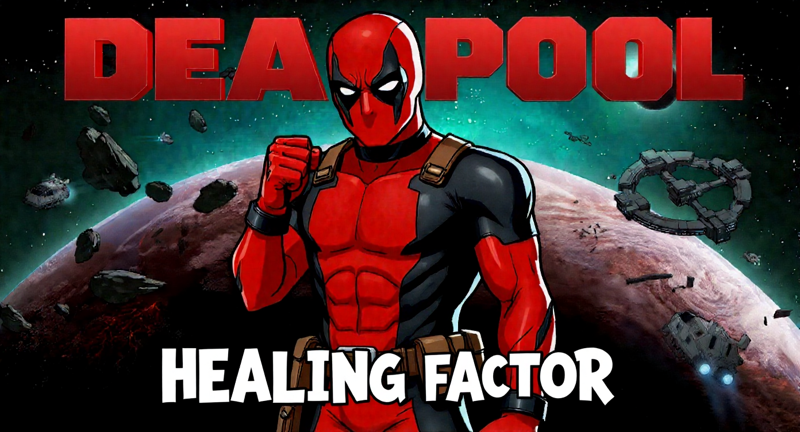

## Deadpool's Healing Factor

Version 0.0.2.0

Hi. It's me. The guy on the cover. I heal fast. Your pawns? Now they do too. Install this and watch limbs regrow, moods skyrocket, and death become a mild inconvenience. Fourth wall? What fourth wall.



### TL;DR
- **What**: A standalone, lightweight RimWorld 1.6 mod that gives pawns Deadpool-style regeneration.
- **Why**: Because losing arms is funny… until it's your crafter.
- **How**: Harmony patch that heals, regrows, and buffs on a configurable schedule.

## Features (Maximum Effort Edition)
- **Healing factor**: Wounds heal automatically at intervals you set. Severity scales the healing.
- **Limb/part regrowth**: Missing parts regrow over time. You can cap how many grow at once and tune the speed.
- **Recovery wobble**: Freshly regrown parts get a short “adjusting” period to keep it spicy.
- **Mood juice**: Optional mood max buff. Because happy pawns shoot straighter. Science.
- **Psychopath switch**: Optional trait application for humanlikes. You wanted Deadpool… you get Deadpool.
- **Snark with settings**: Sliders and toggles for tick rate, heal amount, regrow speed, and more.

## What's in the box?
- **About/**: Metadata and that handsome preview image up there.
- **1.6/**: All the defs for RimWorld 1.6.
  - **Defs/**: Hediffs that make the magic happen.
- **Source/DeadpoolsHealingFactor/**: Clean C# project using Harmony; building will create `1.6/Assemblies` locally.

## Installation
1. Install Harmony first (`brrainz.harmony`). You already have it. If you don't, get it.
2. Drop this mod folder into `RimWorld/Mods`.
3. Activate it in the mod list. Profit.

## In‑Game Settings (aka the Chimichanga Menu)
- **Enable Healing**: Turns the passive healing on/off.
- **Enable Regrowth**: Let those missing parts make a comeback tour.
- **Boost Mood**: Keep mood topped off. Big smiles, fewer tantrums.
- **Force Psychopath**: Applies the Psychopath trait to humanlikes with the factor.
- **Ticks Between Heals**: How often the healing/regrowth logic runs.
- **Base Heal Amount**: How much gets healed per tick, scaled by severity.
- **Regrow Speed**: How fast parts regrow (severity multiplies this).
- **Max Regrowing Parts**: Parallel limbs, baby. Cap the simultaneous regrowths.

## How it works (without the technobabble)
- Pawns with `Healing Factor` get periodic healing based on a tick interval and severity.
- When a missing part is detected and slots are available, regrowth starts on the parent.
- When a part finishes, it's restored and briefly marked as “adjusting” before returning to full strength.
- Optional: mood max and Psychopath trait application (humanlikes only) to stay on theme.

## Compatibility
- Built for RimWorld 1.6.
- Requires Harmony. Load after Harmony (it’s in the metadata already).
- Safe for existing saves. Remove at your own risk; I’m not resurrecting your colony.

## Building from Source
Set the `RimWorldDir` environment variable before building. PowerShell example:

```
$env:RimWorldDir = "C:\\Program Files (x86)\\Steam\\steamapps\\common\\RimWorld"
```

Then build the project in `Source/DeadpoolsHealingFactor`. The build will place a DLL into `1.6/Assemblies` on your machine. This repository no longer ships a precompiled DLL.

## FAQ
- **Does this make pawns immortal?**
  Immortal? Please. That's a big word. Let's just say they'll be really, *really* hard to kill. They can still die from things like, you know, being turned to ash, or if you're a monster and decide to delete their save file. So, not 'immortal,' just... 'inconveniently durable.'
- **Can I turn off the Psychopath thing?**
  Yes. Toggle it in settings.
- **How many limbs can grow back at once?**
  You choose with “Max Regrowing Parts.” Regrowth speed scales with severity.
- **Is it performance‑friendly?**
  Yep. Work happens on a configurable interval and uses cached defs.

## Credits
- Code and design: Dr-Ake
- Harmony magic: Brrainz and contributors
- Inspiration: The unkillable, unshut‑uppable Deadpool
- Also heavy inspiration and special thanks to the Immortal Mod/ Highlander Mod

## License
MIT. See `LICENSE`.

## Disclaimer
Unofficial fan work. Not endorsed by Marvel, Ludeon Studios, or anyone with expensive lawyers. Chimichangas sold separately.
